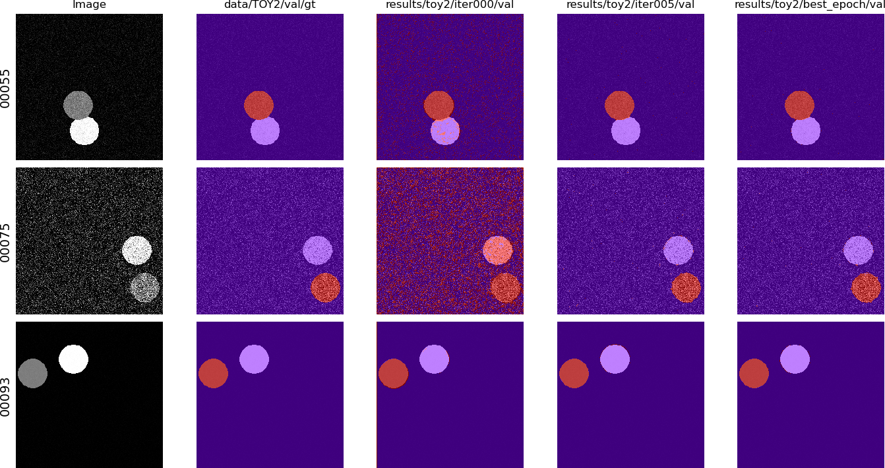
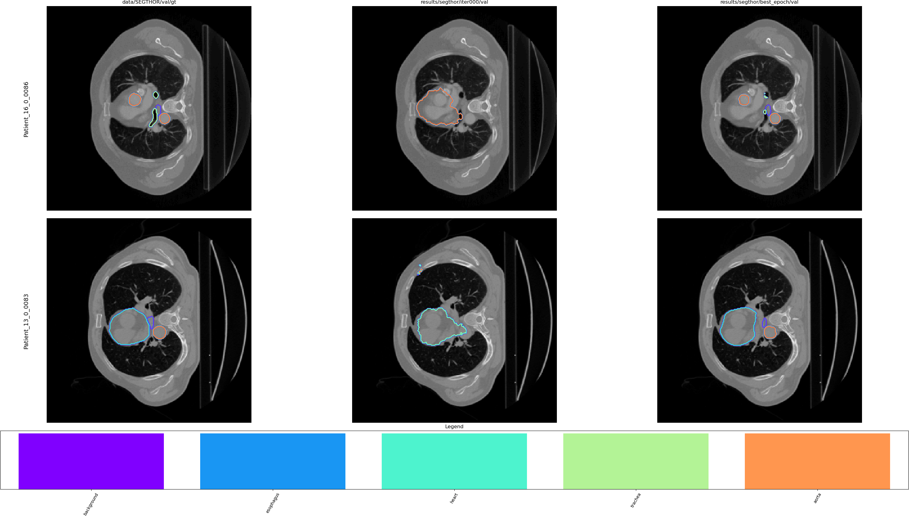
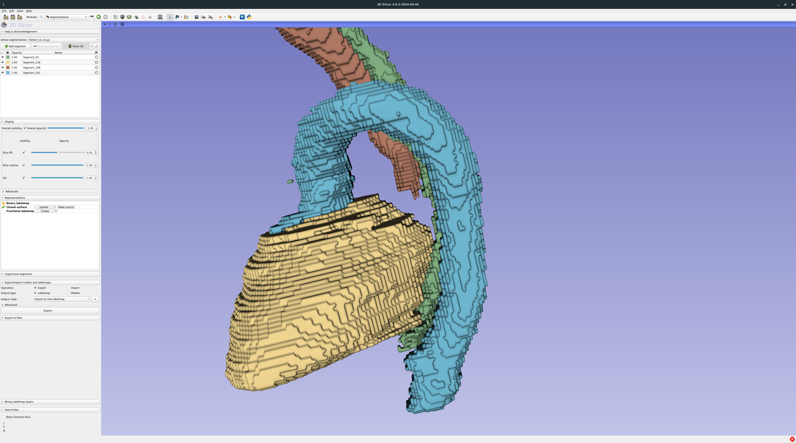

# AI for Medical Imaging — Semantic Segmentation for Organs at Risk
 **University of Amsterdam**

 By Vardan Narula, AnneLouise de Boer, Gina Luijkx, Julotte van der Beek, and Dur e Najaf Amjad 

## Project overview
The project is based around the SegTHOR challenge data, which was kindly allowed by Caroline Petitjean (challenge organizer) to use for the course. The challenge was originally on the segmentation of different organs: heart, aorta, esophagus and trachea.
[TO DO LO]

## Dataset 
[TO DO LO]

## Loss functions
All loss functions are implemented in the [losses.py](losses.py) and can be chosen through the `--loss` argument when running the training process in [main.py](main.py).

### Dice Loss
Dice Loss focuses on the overlap between the predicted and ground truth regions, 
ensuring small regions of interest are not overwhelmed by the background class. 
This is implemented as `DiceLoss()` in the project. 

$L_{dsc}(y, \hat{y}) = 1 - \frac{2 \sum_n y_{nk} \hat{y}_{nk}}{\sum_n y_{nk} + \sum_n \hat{y}_{nk}}$

### (Weighted) Cross Entropy
Cross Entropy Loss is widely used for pixel-wise classification tasks. In the project, it is implemented as `CrossEntropy()` and its weighted version as `Weighted_CrossEntropy()`, where class weights are adjusted to handle class imbalances. The standard Cross Entropy loss is calculated as:

$L_{CE}(y, \hat{y}) = -\frac{1}{N} \sum_{i=1}^{N} \sum_{c=1}^{C} w_c * y_{i,c} \log(\hat{y}_{i,c})$

In the weighted version, the weights \( w_c \) are inversely proportional to the class frequencies.

### Tversky Loss 
Tversky Loss is used to provide a flexible balance between false positives and false negatives. It is implemented as `TverskyLoss()` and allows control over the trade-off using parameters $\alpha$ and $\beta$:

$$L_{tl}(y,\hat{y}) = 1 - \frac{ \sum_{k=1}^{N} y_{nk}\hat{y}_{nk} }{ \sum_{k=1}^{N} y_{nk}\hat{y}_{nk} + \alpha \sum_{k=1}^{N} y_{nk}\hat{y}_{nk} + \beta \sum_{k=1}^{N} y_{nk}\hat{y}_{nk}}$$

This allows for adjusting the weight of false positives (FP) and false negatives (FN), which is crucial in medical segmentation tasks where some types of errors are more critical than others.

### Combined Loss
Our combined loss adds the Dice Loss and Cross Entropy Loss, and is implemented as `"DiceCE"`. 

$L_{dlce} = L_{dsc} + L_{ce}$

## Model Training
### Regular Training
```
$ python main.py --dataset SEGTHOR --mode full --epochs 50 --dest results/segthor/SUNet_Hyb_CE/ce --gpu --model 'UNet' --loss 'CE'

```

| Argument | Default | Choices | Description |
|----------|---------|---------|-------------|
| `--epochs` | 200 | - | Number of training epochs |
| `--dataset` | - | SEGTHOR, TOY2 | Dataset name (required) |
| `--mode` | full | partial, full, weighted | Training mode |
| `--optimizer` | adam | adam, adamW | Optimizer choice |
| `--lr` | 0.0005 | - | Learning rate |
| `--dest` | - | - | Destination directory for results (required) |
| `--num_workers` | 5 | - | Number of worker processes |
| `--gpu` | False | - | Enable GPU usage (flag) |
| `--debug` | False | - | Run in debug mode with reduced dataset (flag) |
| `--model` | enet |ENet, UNet, VNet, SUNet, UNetDR| Model architecture to use |
| `--filter` | None | gaussian, median, non_local_means, bilateral, wavelet | Preprocessing filter |
| `--loss` | CE | CE, Dice, DiceCE, generalised_dice, multiclass_dice, tversky | Loss function |
| `--random_crop_h` | 100 | - | Height for random crop |
| `--random_crop_w` | 100 | - | Width for random crop |
| `--resume` | None | - | Path to model for resuming training |
| `--best_dice` | 0 | - | Best dice value of old model (for resuming) |
| `--dropout_prob` | 0.2 | - | Dropout probability |

#### Multi-phase training
Example of multi-phase training, loading a model trained on *cross entropy* and further training on the *tversky loss*
```
$ python main.py --dataset SEGTHOR --mode full --epochs 50 --dest results/segthor/SUNet_Hyb_CE/ce --gpu --model 'SUNet' --loss 'tversky' --resume 'model/ce_model.pkl' --best_dice 0.891

```

| Parameter | Description |
|-----------|-------------|
| `--dest results/...` | Defines the output directory for results |
| `--model 'SUNet'` | Specifies the model architecture |
| `--loss 'tversky'` | Sets Tversky loss for the fine-tuning phase |
| `--resume 'model/ce_model.pkl'` | Path to the pre-trained model (trained with cross-entropy) |

---------
#### nnU-Net Setup and Training

##### Setup
```bash
# Set environment variables
export nnUNet_raw='/home/scurxxxx/ai4mi_project/nnUNet/nnUNet_raw'
export nnUNet_preprocessed='/home/scurxxxx/ai4mi_project/nnUNet/nnUNet_preprocessed'
export nnUNet_results='/home/scurxxxx/ai4mi_project/nnUNet/nnUNet_results'

# Clone the nnU-Net repository
git clone https://github.com/MIC-DKFZ/nnUNet.git
cd nnUNet

# Install nnU-Net
pip install -e .

# Create necessary directories
mkdir nnUNet_results
mkdir nnUNet_preprocessed

# Navigate back to the project root
cd ..

# Transform data
python nnUnet_transform_data.py --data_dir 'data' --nnUNet_raw 'nnUNet/nnUNet_raw' --nnUNet_preprocessed 'nnUNet/nnUNet_preprocessed'

# Navigate to the nnUNet directory
cd nnUNet

# Plan and preprocess
nnUNetv2_plan_and_preprocess -d 001 --verify_dataset_integrity

# Copy modified files
cp -f /home/scurxxxx/ai4mi_project/nnUNet_Mods/evaluate_predictions.py /home/scurxxxx/ai4mi_project/nnUNet/nnunetv2/evaluation/evaluate_predictions.py
cp -f /home/scurxxxx/ai4mi_project/nnUNet_Mods/nnUNetPlans.json /home/scurxxxx/ai4mi_project/nnUNet/nnUNet_preprocessed/Dataset001_SegTHOR/nnUNetPlans.json
cp -f /home/scurxxxx/ai4mi_project/nnUNet_Mods/nnUNetTrainer.py /home/scurxxxx/ai4mi_project/nnUNet/nnunetv2/training/nnUNetTrainer/nnUNetTrainer.py
cp -f /home/scurxxxx/ai4mi_project/nnUNet_Mods/run_training.py /home/scurxxxx/ai4mi_project/nnUNet/nnunetv2/run/run_training.py
```
##### Run Training
```bash
# 2D UNet with deep supervision
nnUNetv2_train 1 2d 1 --dropout_prob 0.0

# 2D UNet without deep supervision
nnUNetv2_train 1 2dUNet 1 --dropout_prob 0.0

# 2D shallow UNet without dropout
nnUNetv2_train 1 2dshallow 1 --dropout_prob 0.0

# 2D shallow UNet with dropout
nnUNetv2_train 1 2dshallowdropout 1 --dropout_prob 0.2

# 2D UNet with dilated bottleneck
nnUNetv2_train 1 2dUNetDR 1 --dropout_prob 0.0

# 3D full resolution version
nnUNetv2_train 1 3d_fullres 1

# 3D low resolution version
nnUNetv2_train 1 3d_lowres 1
```
#### Plotting
```bash
#To generate a a similar plot to other models you can use :
python plot_dice_nnUNet --file '/home/scurxxxx/ai4mi_project/nnUNet/nnUNet_results/Dataset001_SegTHOR/nnUNetTrainer__nnUNetPlans__2d/fold_1/training_log_2024_10_15_15_54_21.txt' --dest '/home/scurxxxx/ai4mi_project/nnUNet/nnUNet_results/Dataset001_SegTHOR/nnUNetTrainer__nnUNetPlans__2d/dice.png' 
```
##### Results
```bash
#Results are stored in:
/home/scurxxxx/ai4mi_project/nnUNet/nnUNet_results
```
There are job files available for the same : nnUNet_Setup.job, nnUNet_Run.job
## Pre-Processing
The preprocessing steps include resampling and intensity normalization, ensuring that the input data is consistently formatted across datasets. Data augmentation techniques such as random cropping are done on the fly during training.

### Heart label transformation
We use the following affine matrix derived with the SimpleITK library. We use a center-of-mass alignment and rotation to ensure proper alignment of the heart labels. The detailed implementation can be found in [transform.ipynb](transform.ipynb)  
```
[[1.         0.         0.         0.41042964]
 [0.         1.         0.         0.1911134 ]
 [0.         0.         1.         0.00178584]
 [0.         0.         0.         1.        ]]
```
### Gaussian Smoothing
It applies a Gaussian function to smooth the image. This reduces noise and detail, which can help the model generalize patterns.

### Median Filtering
It reduces noise while preserving edges. This works by replacing each pixel with the median value of the pixels around it, helping to smooth out the image without blurring significant features.

### Random Crop
We crop random sections of the image during training, forcing the model to learn on smaller, potentially more varied sections of the image to increase the variety of training samples, improve the model's ability to generalize across different image conditions and prevent overfitting by ensuring the model does not rely too heavily on certain spatial features.

### Rescaling
Rescaling is done to normalize the pixel values, which can enhance the model's learning process and reduce noise. The pixel values were initially in the range 0-256 (Intensity levels in grayscale) and were rescaled to a smaller range, 0-4. 

# Model Architectures
### E-Net


C. He, L. Chen, L. Xu, C. Yang, X. Liu, and B. Yang, "IRLSOT: Inverse Reinforcement Learning for Scene-Oriented Trajectory Prediction," *IET Intelligent Transport Systems*, vol. 16, 2022. [doi:10.1049/itr2.12172](https://doi.org/10.1049/itr2.12172).

### Standard U-Net


O. Ronneberger, P. Fischer, and T. Brox, “U-Net: Convolutional Networks for Biomedical Image Segmentation,” in *Medical Image Computing and Computer-Assisted Intervention (MICCAI)*, ser. LNCS, vol. 9351. Springer, 2015, pp. 234–241. Available: [arXiv:1505.04597](https://arxiv.org/abs/1505.04597).

### nnU-Net


F. Isensee, P. F. Jaeger, S. A. A. Kohl, J. Petersen, and K. H. Maier-Hein, "nnU-Net: A Self-Configuring Method for Deep Learning-Based Biomedical Image Segmentation," *Nature Methods*, vol. 18, no. 2, pp. 203–211, 2021. [Nature Publishing Group](https://www.nature.com/articles/s41592-020-01008-z).
##### Dataset Fingerprint
- (1)
- (2)
- (3)

### sU-Net


Our modified shallow, sU-Net architecture inspired by Lambert et al. (2020). Graph
shows 2D convolutions with ReLU activation + Batch normalisation, residual
concatenations, and max pooling layers. Decoder blocks feature a bilinear
upsampling layer. The network ends with a softmax layer.

### U-Net+DR


Our modified 2D U-Net+DR architecture, based on Vesal et al. (2019). Graph shows
2D convolutions with ReLU activation + Batch normalisation, residual con-
catenations, and max pooling. Decoder blocks feature a bilinear upsampling
layer. The dilated bottleneck employs dilated 2D convolutions for enhanced
feature extraction. The network ends with a softmax layer.

### 2D V-Net


D. Rastogi, P. Johri, and V. Tiwari, "Brain Tumor Segmentation and Tumor Prediction Using 2D-VNet Deep Learning Architecture," in *2021 10th International Conference on System Modeling & Advancement in Research Trends (SMART)*, pp. 723-732, 2021. [doi:10.1109/SMART52563.2021.9676317](https://doi.org/10.1109/SMART52563.2021.9676317).


## Visuals - patient 16
| Ground Truth | U-Net CE | U-Net DR | nnU-Net DR |
|--------------|----------|----------|------------|
|  |  |  |  |

In the figure above, the segmentation results for patient 16 across various models are being
compared: Ground Truth, U-Net CE, U-Net DR, and nnU-Net DR. 

The nnU-Net segmentation showcases a significant improvement, due to its incorporated pre- and post-processing steps. 
Unlike the U-Net variants, the nnU-Net result demonstrates that smaller, disconnected segments are correctly removed. 
By eliminating these small, incorrect fragments, nnU-Net provides a cleaner, more realistic representation of the organs, 
ensuring higher quality in the segmentation output.

## Model Architectures

## Pre and Post Processing of nnU-Net

Training our architectures within the nnU-Net pipeline automates pre- and post-processing steps, reducing manual intervention and increasing model robustness. 

### Pre-processing
The preprocessing steps include resampling and intensity normalization, ensuring that the input data is consistently formatted across datasets. Data augmentation techniques such as random cropping are done on the fly during training.

### Post-processing
The post-processing phase ensures the accuracy of the segmentation by enforcing single connected components, helping remove small artifacts.  The process involves automated evaluation of connected components and removal of small structures that do not meet certain size criteria, reducing noise and improving segmentation accuracy. Additionally, the decoder effectively integrates higher-resolution feature maps to enhance segmentation precision. 

The nnU-Net framework, both in its 2D and 3D low/high-resolution forms, provides an automated pipeline for image segmentation. The low-resolution 3D nnU-Net captures broader contextual information by working with downsampled data, which helps in detecting large-scale structures. Meanwhile, the high-resolution 3D nnU-Net operates on finer-resolution data, allowing it to capture small details and precise boundaries. 

## Evaluation Metrics
TO DO; link to file with HD95 computation and DSC (VARDAN?)

## Results

### Results on internal validation set (DSC)


### Results for Best performing models

### nnU-Net based performance metrics

### Results on test set

| Patient   | E-Net (Baseline) | U-Net CE | U-Net DR | sUnet |
|-----------|------------------|----------|----------|-------|
| Patient 41 |  |  |  |  |
| Patient 42 |  |  |  |  |


## TO DO

[] how to run training description

[] metrics computation 

[] storing the best saved model

[] metrics computed (Need to be 3d?)

## Codebase features
This codebase is given as a starting point, to provide an initial neural network that converges during training. (For broader context, this is itself a fork of an [older conference tutorial](https://github.com/LIVIAETS/miccai_weakly_supervised_tutorial) we gave few years ago.) It also provides facilities to locally run some test on a laptop, with a toy dataset and dummy network.

Summary of codebase (in PyTorch)
* slicing the 3D Nifti files to 2D `.png`;
* stitching 2D `.png` slices to 3D volume compatible with initial nifti files;
* basic 2D segmentation network;
* basic training and printing with cross-entroly loss and Adam;
* partial cross-entropy alternative as a loss (to disable one class during training);
* debug options and facilities (cpu version, "dummy" network, smaller datasets);
* saving of predictions as `.png`;
* log the 2D DSC and cross-entropy over time, with basic plotting;
* tool to compare different segmentations (`viewer/viewer.py`).

**Some recurrent questions might be addressed here directly.** As such, it is expected that small change or additions to this readme to be made.

## Codebase use
In the following, a line starting by `$` usually means it is meant to be typed in the terminal (bash, zsh, fish, ...), whereas no symbol might indicate some python code.

### Setting up the environment
```
$ git clone https://github.com/HKervadec/ai4mi_project.git
$ cd ai4mi_project
$ git submodule init
$ git submodule update
```

This codebase was written for a somewhat recent python (3.10 or more recent). (**Note: Ubuntu and some other Linux distributions might make the distasteful choice to have `python` pointing to 2.+ version, and require to type `python3` explicitly.**) The required packages are listed in [`requirements.txt`](requirements.txt) and a [virtual environment](https://docs.python.org/3/library/venv.html) can easily be created from it through [pip](https://pypi.org/):
```
$ python -m venv ai4mi
$ source ai4mi/bin/activate
$ which python  # ensure this is not your system's python anymore
$ python -m pip install -r requirements.txt
```
Conda is an alternative to pip, but is recommended not to mix `conda install` and `pip install`.

### Getting the data
The synthetic dataset is generated randomly, whereas for Segthor it is required to put the file [`segthor_train.zip`](https://amsuni-my.sharepoint.com/:u:/g/personal/h_t_g_kervadec_uva_nl/EfMdFte7pExAnPwt4tYUcxcBbJJO8dqxJP9r-5pm9M_ARw?e=ZNdjee) (required a UvA account) in the `data/` folder. If the computer running it is powerful enough, the recipe for `data/SEGTHOR` can be modified in the [Makefile](Makefile) to enable multi-processing (`-p -1` option, see `python slice_segthor.py --help` or its code directly).
```
$ make data/TOY2
$ make data/SEGTHOR
```

For windows users, you can use the following instead
```
$ rm -rf data/TOY2_tmp data/TOY2
$ python gen_two_circles.py --dest data/TOY2_tmp -n 1000 100 -r 25 -wh 256 256
$ mv data/TOY2_tmp data/TOY2

$ sha256sum -c data/segthor_train.sha256
$ unzip -q data/segthor_train.zip

$ rm -rf data/SEGTHOR_tmp data/SEGTHOR
$ python  slice_segthor.py --source_dir data/segthor_train --dest_dir data/SEGTHOR_tmp \
         --shape 256 256 --retain 10
$ mv data/SEGTHOR_tmp data/SEGTHOR
````

### Viewing the data
The data can be viewed in different ways:
- looking directly at the `.` in the sliced folder (`data/SEGTHOR`);
- using the provided "viewer" to compare segmentations ([see below](#viewing-the-results));
- opening the Nifti files from `data/segthor_train` with [3D Slicer](https://www.slicer.org/) or [ITK Snap](http://www.itksnap.org).

### Training a base network
Running a training
```
$ python main.py --help
usage: main.py [-h] [--epochs EPOCHS] [--dataset {TOY2,SEGTHOR}] [--mode {partial,full}] --dest DEST [--gpu] [--debug]

options:
  -h, --help            show this help message and exit
  --epochs EPOCHS
  --dataset {TOY2,SEGTHOR}
  --mode {partial,full}
  --dest DEST           Destination directory to save the results (predictions and weights).
  --gpu
  --debug               Keep only a fraction (10 samples) of the datasets, to test the logic around epochs and logging easily.
$ python main.py --dataset TOY2 --mode full --epoch 25 --dest results/toy2/ce --gpu
```

The codebase uses a lot of assertions for control and self-documentation, they can easily be disabled with the `-O` option (for faster training) once everything is known to be correct (for instance run the previous command for 1/2 epochs, then kill it and relaunch it):
```
$ python -O main.py --dataset TOY2 --mode full --epoch 25 --dest results/toy2/ce --gpu
```

### Viewing the results
#### 2D viewer
Comparing some predictions with the provided [viewer](viewer/viewer.py) (right-click to go to the next set of images, left-click to go back):
```
$ python viewer/viewer.py --img_source data/TOY2/val/img \
    data/TOY2/val/gt results/toy2/ce/iter000/val results/toy2/ce/iter005/val results/toy2/ce/best_epoch/val \
    --show_img -C 256 --no_contour
```

**Note:** if using it from a SSH session, it requires X to be forwarded ([Unix/BSD](https://man.archlinux.org/man/ssh.1#X), [Windows](https://mobaxterm.mobatek.net/documentation.html#1_4)) for it to work. Note that X forwarding also needs to be enabled on the server side.


```
$ python viewer/viewer.py --img_source data/SEGTHOR/val/img \
    data/SEGTHOR/val/gt results/segthor/ce/iter000/val results/segthor/ce/best_epoch/val \
    -n 2 -C 5 --remap "{63: 1, 126: 2, 189: 3, 252: 4}" \
    --legend --class_names background esophagus heart trachea aorta
```


#### 3D viewers
To look at the results in 3D, it is necessary to reconstruct the 3D volume from the individual 2D predictions saved as images.
To stitch the `.png` back to a nifti file:
```
$ python stitch.py --data_folder results/segthor/ce/best_epoch/val \
    --dest_folder volumes/segthor/ce \
    --num_classes 255 --grp_regex "(Patient_\d\d)_\d\d\d\d" \
    --source_scan_pattern "data/segthor_train/train/{id_}/GT.nii.gz"
```

[3D Slicer](https://www.slicer.org/) and [ITK Snap](http://www.itksnap.org) are two popular viewers for medical data, here comparing `GT.nii.gz` and the corresponding stitched prediction `Patient_01.nii.gz`:


Zooming on the prediction with smoothing disabled:



### Plotting the metrics
There are some facilities to plot the metrics saved by [`main.py`](main.py):
```
$ python plot.py --help
usage: plot.py [-h] --metric_file METRIC_MODE.npy [--dest METRIC_MODE.png] [--headless]

Plot data over time

options:
  -h, --help            show this help message and exit
  --metric_file METRIC_MODE.npy
                        The metric file to plot.
  --dest METRIC_MODE.png
                        Optional: save the plot to a .png file
  --headless            Does not display the plot and save it directly (implies --dest to be provided.
$ python plot.py --metric_file results/segthor/ce/dice_val.npy --dest results/segthor/ce/dice_val.png
```


Plotting and visualization ressources:
* [Scientific visualization Python + Matplotlib](https://github.com/rougier/scientific-visualization-book)
* [Seaborn](https://seaborn.pydata.org/examples/index.html)
* [Plotly](https://github.com/plotly/plotly.py)

## Submission and scoring
Groups will have to submit:
* archive of the git repo with the whole project, which includes:
    * pre-processing;
    * training;
    * post-processing where applicable;
    * inference;
    * metrics computation;
    * script fixing the data using the matrix `AFF` from `affine.py` (or rather its inverse);
    * (bonus) any solution fixing patient27 without recourse to `affine.py`;
    * (bonus) any (even partial) solution fixing the whole dataset without recourse to `affine.py`;
* the best trained model;
* predictions on the [test set](https://amsuni-my.sharepoint.com/:u:/g/personal/h_t_g_kervadec_uva_nl/EWZH7ylUUFFCg3lEzzLzJqMBG7OrPw1K4M78wq9t5iBj_w?e=Yejv5d) (`sha256sum -c data/test.zip.sha256` as optional checksum);
* predictions on the group's internal validation set, the labels of their validation set, and the metrics they computed.

The main criteria for scoring will include:
* improvement of performances over baseline;
* code quality/clear [git use](git.md);
* the [choice of metrics](https://metrics-reloaded.dkfz.de/) (they need to be in 3D);
* correctness of the computed metrics (on the validation set);
* (part of the report) clear description of the method;
* (part of the report) clever use of visualization to report and interpret your results;
* report;
* presentation.

The `(bonus)` lines give extra points, that can ultimately compensate other parts of the project/quizz.


### Packing the code
`$ git bundle create group-XX.bundle master`

### Saving the best model
`torch.save(net, args.dest / "bestmodel-group-XX.pkl")`

### Archiving everything for submission
All files should be grouped in single folder with the following structure
```
group-XX/
    test/
        pred/
            Patient_41.nii.gz
            Patient_42.nii.gz
            ...
    val/
        pred/
            Patient_21.nii.gz
            Patient_32.nii.gz
            ...
        gt/
            Patient_21.nii.gz
            Patient_32.nii.gz
            ...
        metric01.npy
        metric02.npy
        ...
    group-XX.bundle
    bestmodel-group-XX.pkl
```
The metrics should be numpy `ndarray` with the shape `NxKxD`, with `N` the number of scan in the subset, `K` the number of classes (5, including background), and `D` the eventual dimensionality of the metric (can be simply 1).

The folder should then be [tarred](https://xkcd.com/1168/) and compressed, e.g.:
```
$ tar cf - group-XX/ | zstd -T0 -3 > group-XX.tar.zst
$ tar cf group-XX.tar.gz - group-XX/
```


