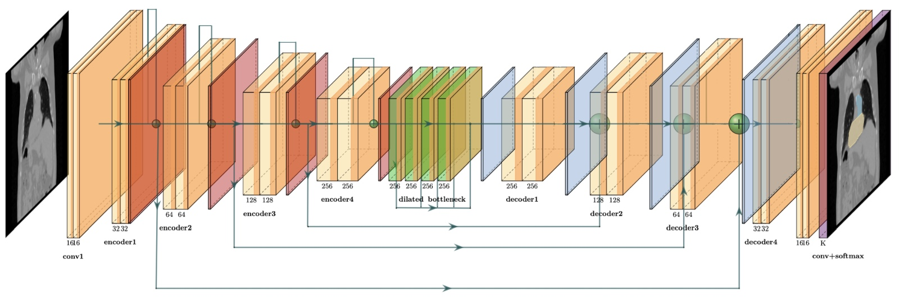

# Semantic Segmentation for Thoracic Organs at Risk
 **University of Amsterdam - AI for Medical Imaging 2024**

 By Vardan Narula, AnneLouise de Boer, Gina Luijkx, Julotte van der Beek, and Dur e Najaf Amjad 

## Project overview
This project is based around the SegTHOR challenge data. The challenge is based on the segmentation of the following organs: heart, aorta, esophagus and trachea. We evaluate a range of existing models, including E-Net, U-Net, V-Net, and two U-Net variants (sU-Net, U-Net+DR) on the task of multi-organ segmentation. In addition, we train these architectures in the nnU-Net training pipeline. 

### Results on test set
#### Initial training
| Patient   | (1) E-Net (Baseline) | (2) U-Net | (3) U-Net+DR | (4) sU-Net |
|-----------|------------------|----------|----------|-------|
| Patient 41 |  |  |  |  |
| Patient 42 |  |  |  |  |

*Segmentation for our best performing models and baseline, as measured by the 3D DSC on a hidden validation set. The visualisations above show segmentation results for two patients in the test set. (1) E-net trained on ce (2) 2D U-Net trained on wce. (3)  U-Net+DR trained on ce (4) sU-Net trained on dlce. Loss functions used are cross-entropy (ce), dice loss (dl), combined loss (dlce), and weighted cross-entropy (wce).*

#### Training architectures inside the nnU-Net pipeline

| Patient   | (1) 2D U-Net d.s. | (2) 2D U-Net |  (3) U-Net + DR | (4) E-Net | 
|-----------|------------------|----------|----------|-------|
| Patient 41 |  |  |  |  |
| Patient 42 |  |   |  |  |

*Segmentation for a variety of models trained in the nnU-Net pipeline. The visualisations above show segmentation results for two patients in the test set. With (1) a nnU-Net-configured U-Net trained with deep supervision, (2) a standard U-Net topology without
dataset-specific configuration, and (3) our custom U-Net variant U-Net + DR, and (4) E-Net integrated into the nnU-Net training
pipeline.*

## Setup

<details>
<summary>Click to expand environment setup </summary>
 
### Setting up the environment
This codebase was written for python 3.10 or more recent. Please ensure the virtual environment is in the correct python version.
```
$ git clone https://github.com/HKervadec/ai4mi_project.git
$ cd ai4mi_project
$ git submodule init
$ git submodule update

# virtual environment
$ python -m venv ai4mi
$ source ai4mi/bin/activate
$ which python  # ensure this is not your system's python anymore
$ python -m pip install -r requirements.txt
```
---------
</details>

<details>
<summary>Click to expand data setup </summary>

### Getting the data
The synthetic dataset is generated randomly, whereas for Segthor it is required to put the file [`segthor_train.zip`](https://amsuni-my.sharepoint.com/:u:/g/personal/h_t_g_kervadec_uva_nl/EfMdFte7pExAnPwt4tYUcxcBbJJO8dqxJP9r-5pm9M_ARw?e=ZNdjee) (required a UvA account) in the `data/` folder. If the computer running it is powerful enough, the recipe for `data/SEGTHOR` can be modified in the [Makefile](Makefile) to enable multi-processing (`-p -1` option, see `python slice_segthor.py --help` or its code directly).
```
$ make data/TOY2
$ make data/SEGTHOR
```
For windows users, you can use the following instead
```
$ rm -rf data/TOY2_tmp data/TOY2
$ python gen_two_circles.py --dest data/TOY2_tmp -n 1000 100 -r 25 -wh 256 256
$ mv data/TOY2_tmp data/TOY2

$ sha256sum -c data/segthor_train.sha256
$ unzip -q data/segthor_train.zip

$ rm -rf data/SEGTHOR_tmp data/SEGTHOR
$ python  slice_segthor.py --source_dir data/segthor_train --dest_dir data/SEGTHOR_tmp \
         --shape 256 256 --retain 10
$ mv data/SEGTHOR_tmp data/SEGTHOR
````
</details>

## Loss functions
All loss functions are implemented in the [losses.py](losses.py) and can be chosen through the `--loss` argument when running the training process in [main.py](main.py). The file contains implementations of the `DiceLoss()` ,`CrossEntropy()`, `Weighted_CrossEntropy()`, and  `TverskyLoss()`. Our combined loss adds the Dice Loss and Cross Entropy Loss, and is implemented as `DiceCE()`.

$L_{dlce} = L_{dsc} + L_{ce}$


## Model Training
### Regular Training
```
$ python main.py --dataset SEGTHOR --mode full --epochs 50 --dest results/segthor/SUNet_Hyb_CE/ce --gpu --model 'UNet' --loss 'CE'

```
<details>
<summary>Click to expand training options</summary>


| Argument | Default | Choices | Description |
|----------|---------|---------|-------------|
| `--epochs` | 200 | - | Number of training epochs |
| `--dataset` | - | SEGTHOR, TOY2 | Dataset name (required) |
| `--mode` | full | partial, full, weighted | Training mode |
| `--optimizer` | adam | adam, adamW | Optimizer choice |
| `--lr` | 0.0005 | - | Learning rate |
| `--dest` | - | - | Destination directory for results (required) |
| `--num_workers` | 5 | - | Number of worker processes |
| `--gpu` | False | - | Enable GPU usage (flag) |
| `--debug` | False | - | Run in debug mode with reduced dataset (flag) |
| `--model` | enet |ENet, UNet, VNet, SUNet, UNetDR| Model architecture to use |
| `--filter` | None | gaussian, median, non_local_means, bilateral, wavelet | Preprocessing filter |
| `--loss` | CE | CE, Dice, DiceCE, tversky | Loss function |
| `--random_crop_h` | 100 | - | Height for random crop |
| `--random_crop_w` | 100 | - | Width for random crop |
| `--resume` | None | - | Path to model for resuming training |
| `--best_dice` | 0 | - | Best dice value of old model (for resuming) |
| `--dropout_prob` | 0.0 | - | Dropout probability |

---------

</details>


#### Multi-phase training
Example of multi-phase training, loading a model trained on *cross entropy* and further training on the *tversky loss*
```
$ python main.py --dataset SEGTHOR --mode full --epochs 50 --dest results/segthor/SUNet_Hyb_CE/ce --gpu --model 'SUNet' --loss 'tversky' --resume 'model/ce_model.pkl' --best_dice 0.891

```

| Parameter | Description |
|-----------|-------------|
| `--dest results/...` | Defines the output directory for results |
| `--model 'SUNet'` | Specifies the model architecture |
| `--loss 'tversky'` | Sets Tversky loss for the fine-tuning phase |
| `--resume 'model/ce_model.pkl'` | Path to the pre-trained model (trained with cross-entropy) |

---------

### Generate volumes of predictions
```bash
python stitch.py --data_folder results/segthor/SUNet_Hyb_CE/ce/best_epoch/val --dest_folder volumes/segthor/SUNet_Hyb_CE/ce --num_classes 255 --grp_regex "(Patient_\d\d)_\d\d\d\d" --source_scan_pattern "data/segthor_train/train/{id_}/GT.nii.gz"
```

### Plot the dice score over epochs
```bash
python plot.py --metric_file results/segthor/SUNet_Hyb_CE/ce/dice_val.npy --dest results/segthor/SUNet_Hyb_CE/ce/dice_val.png
```

#### Plot the HD/HD95 plots
```bash
python evaluation.py --model 'SUNet' --base_folder 'SUNet_Hyb_CE'
```
---------

#### nnU-Net Setup and Training

##### Setup
```bash
# Set environment variables
export nnUNet_raw='/home/scurxxxx/ai4mi_project/nnUNet/nnUNet_raw'
export nnUNet_preprocessed='/home/scurxxxx/ai4mi_project/nnUNet/nnUNet_preprocessed'
export nnUNet_results='/home/scurxxxx/ai4mi_project/nnUNet/nnUNet_results'

# Clone the nnU-Net repository
git clone https://github.com/MIC-DKFZ/nnUNet.git
cd nnUNet

# Install nnU-Net
pip install -e .

# Create necessary directories
mkdir nnUNet_results
mkdir nnUNet_preprocessed

# Navigate back to the project root
cd ..

# Transform data
python nnUnet_transform_data.py --data_dir 'data' --nnUNet_raw 'nnUNet/nnUNet_raw' --nnUNet_preprocessed 'nnUNet/nnUNet_preprocessed'

# Navigate to the nnUNet directory
cd nnUNet

# Plan and preprocess
nnUNetv2_plan_and_preprocess -d 001 --verify_dataset_integrity

# Copy modified files
cp -f /home/scurxxxx/ai4mi_project/nnUNet_Mods/evaluate_predictions.py /home/scurxxxx/ai4mi_project/nnUNet/nnunetv2/evaluation/evaluate_predictions.py
cp -f /home/scurxxxx/ai4mi_project/nnUNet_Mods/nnUNetPlans.json /home/scurxxxx/ai4mi_project/nnUNet/nnUNet_preprocessed/Dataset001_SegTHOR/nnUNetPlans.json
cp -f /home/scurxxxx/ai4mi_project/nnUNet_Mods/nnUNetTrainer.py /home/scurxxxx/ai4mi_project/nnUNet/nnunetv2/training/nnUNetTrainer/nnUNetTrainer.py
cp -f /home/scurxxxx/ai4mi_project/nnUNet_Mods/run_training.py /home/scurxxxx/ai4mi_project/nnUNet/nnunetv2/run/run_training.py
```
##### Run Training
```bash
# 2D UNet with deep supervision
nnUNetv2_train 1 2d 1 --dropout_prob 0.0

# 2D UNet without deep supervision
nnUNetv2_train 1 2dUNet 1 --dropout_prob 0.0

# 2D shallow UNet without dropout
nnUNetv2_train 1 2dshallow 1 --dropout_prob 0.0

# 2D shallow UNet with dropout
nnUNetv2_train 1 2dshallowdropout 1 --dropout_prob 0.2

# 2D UNet with dilated bottleneck
nnUNetv2_train 1 2dUNetDR 1 --dropout_prob 0.0

# 2D ENet
nnUNetv2_train 1 2dENet 1 

# 3D full resolution version
nnUNetv2_train 1 3d_fullres 1

# 3D low resolution version
nnUNetv2_train 1 3d_lowres 1
```
#### Plotting
```bash
#To generate a a similar plot to other models you can use :
python plot_dice_nnUNet --file '/home/scurxxxx/ai4mi_project/nnUNet/nnUNet_results/Dataset001_SegTHOR/nnUNetTrainer__nnUNetPlans__2d/fold_1/training_log_2024_10_15_15_54_21.txt' --dest '/home/scurxxxx/ai4mi_project/nnUNet/nnUNet_results/Dataset001_SegTHOR/nnUNetTrainer__nnUNetPlans__2d/dice.png' 
```
##### Results
```bash
#Results are stored in:
/home/scurxxxx/ai4mi_project/nnUNet/nnUNet_results
```
##### Inference on Test Set
Rename the test_set to the following format:


Run this to generate the final predicitons
```bash
#predictions on 2dshallow-UNet
nnUNetv2_predict -i '/home/scurXXXX/ai4mi_project/data/segthor_test/test_nnUNet' -o '/home/scurXXXX/ai4mi_project/nnUNet_2dshallow_test_pred' -d 1 -c 2dshallow --save_probabilities -f 1
#predictions on 2dUNet
nnUNetv2_predict -i '/home/scurXXXX/ai4mi_project/data/segthor_test/test_nnUNet' -o '/home/scurXXXX/ai4mi_project/nnUNet_2dUNet_test_pred' -d 1 -c 2dUNet --save_probabilities -f 1
#predictions on 2dUNet+DR
nnUNetv2_predict -i '/home/scurXXXX/ai4mi_project/data/segthor_test/test_nnUNet' -o '/home/scurXXXX/ai4mi_project/nnUNet_2dUNetDR_test_pred' -d 1 -c 2dUNetDR --save_probabilities -f 1
#predictions on 2dUNet w ds
nnUNetv2_predict -i '/home/scurXXXX/ai4mi_project/data/segthor_test/test_nnUNet' -o '/home/scurXXXX/ai4mi_project/nnUNet_2d_test_pred' -d 1 -c 2d --save_probabilities -f 1
```
There are job files available for the same : nnUNet_Setup.job, nnUNet_Run.job, nnUNet_Infer.job

---------

## Manual Pre-Processing
The preprocessing steps include resampling and intensity normalization, ensuring that the input data is consistently formatted across datasets. Data augmentation techniques such as random cropping are done on the fly during training.

### Heart label transformation
We use the following affine matrix derived with the SimpleITK library. We use a center-of-mass alignment and rotation to ensure proper alignment of the heart labels. The detailed implementation can be found in [transform.ipynb](heart_transform/transform.ipynb)  
```
[[1.         0.         0.         0.41042964]
 [0.         1.         0.         0.1911134 ]
 [0.         0.         1.         0.00178584]
 [0.         0.         0.         1.        ]]
```
### Gaussian Smoothing
It applies a Gaussian function to smooth the image. This reduces noise and detail, which can help the model generalize patterns.

### Median Filtering
It reduces noise while preserving edges. This works by replacing each pixel with the median value of the pixels around it, helping to smooth out the image without blurring significant features.

### Random Crop
We crop random sections of the image during training, forcing the model to learn on smaller, potentially more varied sections of the image to increase the variety of training samples, improve the model's ability to generalize across different image conditions and prevent overfitting by ensuring the model does not rely too heavily on certain spatial features.

### Rescaling
Rescaling is done to normalize the pixel values, which can enhance the model's learning process and reduce noise. The pixel values were initially in the range 0-256 (Intensity levels in grayscale) and were rescaled to a smaller range, 0-4. 

## Automated Pre and Post Processing of the nnU-Net framework
Training our architectures within the nnU-Net pipeline automates pre- and post-processing steps, reducing manual intervention and increasing model robustness. 

*F. Isensee, P. F. Jaeger, S. A. A. Kohl, J. Petersen, and K. H. Maier-Hein, "nnU-Net: A Self-Configuring Method for Deep Learning-Based Biomedical Image Segmentation," *Nature Methods*, vol. 18, no. 2, pp. 203–211, 2021. [Nature Publishing Group](https://www.nature.com/articles/s41592-020-01008-z).*

##### Segthor Dataset Fingerprint
- (1) Distribution of spacings: standardize to $0.976 \times 0.976 \times 2.5 mm^3$
- (2) Median image size 512 x 512 voxels  
- (3) Intensity distribution: Pixel values are in the range of 0-256 (greyscale)
- (4) Image modality: CT 

### Pre-processing
In this implementation, based on the [dataset fingerprint](data2/dataset_fingerprint.json) images are resampled in-plane with third order spline, out of plane with nearest neighbour. Intensity normalization for CT images (CTNormalization scheme) involves global data percentile clipping and z-score normalization using the global foreground mean, helping the model to generalize better during training. 
### Post-processing

| Ground Truth | (1) U-Net | (2) U-Net+DR  | (3) nnU-Net+DR |
|--------------|----------|----------|------------|
|  |  |  |  |

*In the figure above, the segmentation results for patient 16 across various models are being
compared: Ground Truth, (1) U-Net (trained on cross entropy) , (2) U-Net+DR (trained on combined loss), (3) and U-Net+DR trained inside the nnU-net pipleine.*

The nnU-Net segmentation (case 3) showcases a significant improvement compared to regular training (1) and (2), due to its **incorporated pre- and post-processing steps**. Unlike the U-Net variants, the nnU-Net result demonstrates that smaller, disconnected segments are correctly removed. 
By eliminating these small, incorrect fragments, nnU-Net provides a cleaner, more realistic representation of the organs, 
ensuring higher quality in the segmentation output.


# Model Architectures
### E-Net

*C. He, L. Chen, L. Xu, C. Yang, X. Liu, and B. Yang, "IRLSOT: Inverse Reinforcement Learning for Scene-Oriented Trajectory Prediction," *IET Intelligent Transport Systems*, vol. 16, 2022. [doi:10.1049/itr2.12172](https://doi.org/10.1049/itr2.12172).*

### Standard U-Net

*O. Ronneberger, P. Fischer, and T. Brox, “U-Net: Convolutional Networks for Biomedical Image Segmentation,” in *Medical Image Computing and Computer-Assisted Intervention (MICCAI)*, ser. LNCS, vol. 9351. Springer, 2015, pp. 234–241. Available: [arXiv:1505.04597](https://arxiv.org/abs/1505.04597).*


### sU-Net


Our modified shallow, sU-Net architecture inspired by Lambert et al. (2020). Graph
shows 2D convolutions with ReLU activation + Batch normalisation, residual
concatenations, and max pooling layers. Decoder blocks feature a bilinear
upsampling layer. The network ends with a softmax layer.

### U-Net+DR


Our modified 2D U-Net+DR architecture, based on Vesal et al. (2019). Graph shows
2D convolutions with ReLU activation + Batch normalisation, residual con-
catenations, and max pooling. Decoder blocks feature a bilinear upsampling
layer. The dilated bottleneck employs dilated 2D convolutions for enhanced
feature extraction. The network ends with a softmax layer.

### 2D V-Net


D. Rastogi, P. Johri, and V. Tiwari, "Brain Tumor Segmentation and Tumor Prediction Using 2D-VNet Deep Learning Architecture," in *2021 10th International Conference on System Modeling & Advancement in Research Trends (SMART)*, pp. 723-732, 2021. [doi:10.1109/SMART52563.2021.9676317](https://doi.org/10.1109/SMART52563.2021.9676317).


## Evaluation Metrics
To assess the performance of our organ segmentation models, we employ two primary metrics for each OAR: the Dice Similarity Coefficient (DSC) implemented in [main.py](main.py) and calculated after every epoch. And the 95\% Hausdorff Distance (HD95) expressed in $mm$, implemented in [evaluation.py](evaluation.py). 

### Dice Similarity Coefficient (DSC)
The Dice Similarity Coefficient (DSC) focuses on the overlap between predicted and ground truth segmentations. It provides a score between 0 and 1, with 1 indicating perfect overlap. In our project, we compute 3D DSC for all models.

$DSC(G,P) = \frac{2 \times |P \cap G|}{|P| + |G|}$


### 95th Percentile Hausdorff Distance (HD95)
The 95th percentile Hausdorff Distance (HD95) measures boundary precision by calculating the 95th percentile of the distances between boundary points of the predicted and ground truth segmentations. This helps account for worst-case boundary discrepancies while ignoring extreme outliers.

$HD95(G,P) = \text{percentile}{95} \left( \min{p \in P} || g - p || \right)$

HD95 is used as a 3D metric for all models in our project. 

### Results on validation set 
**Regular training**


*Segmentation results for our best performing models, measured by the 3D DSC on a hidden validation set. The table shows results for the best epoch. Loss functions used are cross-entropy (ce), dice loss (dl), combined loss (dlce), and weighted cross-entropy (wce). For each organ, the **best** 3D DSC and <ins> best </ins> HD95 are marked.*

**Training architectures inside the nnU-Net pipeline**
The table below presents a comprehensive comparison of four scenarios:  (1) an nnU-Net-configured U-Net trained with deep supervision, (2) a standard U-Net topology without dataset-specific configuration, and (3) our custom U-Net variants, and (4) E-Net integrated into the nnU-Net training pipeline.


*nnU-Net based performance metrics, **d.s.** denotes "deep supervision"; absence implies no deep supervision. For each organ, the **best** 3D DSC and <ins> best </ins> HD95 are marked.*

## Submission and scoring [TO DO remove]
Groups will have to submit:
* archive of the git repo with the whole project, which includes:
    * pre-processing;
    * training;
    * post-processing where applicable;
    * inference;
    * metrics computation;
    * script fixing the data using the matrix `AFF` from `affine.py` (or rather its inverse);
    * (bonus) any solution fixing patient27 without recourse to `affine.py`;
    * (bonus) any (even partial) solution fixing the whole dataset without recourse to `affine.py`;
* the best trained model;
* predictions on the [test set](https://amsuni-my.sharepoint.com/:u:/g/personal/h_t_g_kervadec_uva_nl/EWZH7ylUUFFCg3lEzzLzJqMBG7OrPw1K4M78wq9t5iBj_w?e=Yejv5d) (`sha256sum -c data/test.zip.sha256` as optional checksum);
* predictions on the group's internal validation set, the labels of their validation set, and the metrics they computed.

The main criteria for scoring will include:
* improvement of performances over baseline;
* code quality/clear [git use](git.md);
* the [choice of metrics](https://metrics-reloaded.dkfz.de/) (they need to be in 3D);
* correctness of the computed metrics (on the validation set);
* (part of the report) clear description of the method;
* (part of the report) clever use of visualization to report and interpret your results;
* report;
* presentation.

The `(bonus)` lines give extra points, that can ultimately compensate other parts of the project/quizz.


### Packing the code
`$ git bundle create group-XX.bundle master`

### Saving the best model
`torch.save(net, args.dest / "bestmodel-group-XX.pkl")`

### Archiving everything for submission
All files should be grouped in single folder with the following structure
```
group-XX/
    test/
        pred/
            Patient_41.nii.gz
            Patient_42.nii.gz
            ...
    val/
        pred/
            Patient_21.nii.gz
            Patient_32.nii.gz
            ...
        gt/
            Patient_21.nii.gz
            Patient_32.nii.gz
            ...
        metric01.npy
        metric02.npy
        ...
    group-XX.bundle
    bestmodel-group-XX.pkl
```
The metrics should be numpy `ndarray` with the shape `NxKxD`, with `N` the number of scan in the subset, `K` the number of classes (5, including background), and `D` the eventual dimensionality of the metric (can be simply 1).

The folder should then be [tarred](https://xkcd.com/1168/) and compressed, e.g.:
```
$ tar cf - group-XX/ | zstd -T0 -3 > group-XX.tar.zst
$ tar cf group-XX.tar.gz - group-XX/
```


